# HTML2PDF
此项目用于把多个 html 文件转换并合并为一个 pdf 文件。



## 准备工作
```shell
make build # 构建本地镜像
make run # 启动容器 (默认挂载的是宿主机的/tmp目录)
make exec # 进入容器
html2pdf> npm install 
```
## 使用

1. html 转为 pdf
    ```shell
    node html2pdf.js <html_input_dir> <pdf_out_dir>
    ```
1. 合并 pdf
    ```shell
    node mergepdf.js <pdf_input_dir> <pdf_output_filename>
    ```
1. 添加大纲/目录
    1. 根据 pdf 页码生成目录页码
        ```shell
        node generateOutline.js <pdf_input_dir> > book.toc
        ```
    1. 可以使用 ghostscript，也可使用已封装好的 lib，例如: [pdfoutline](https://github.com/yutayamamoto/pdfoutline)。

# 测试结果
## 验证通过
- 在 Linux x86、 Linux ARM64 上运行良好
## 已知问题
- 在 Apple Silicon 上使用 `puppeteer` 保存的 PDF 文件有问题（文字复制出现倒序情况）
- 在 Apple Silicon 上使用 `ghostscript` 创建目录后的 PDF 文件有问题（文字复制乱码）
- ~~若是 PDF 文件名是中文，则需要配置中文字符集，否则合并 PDF 时会报找不到文件的错误~~